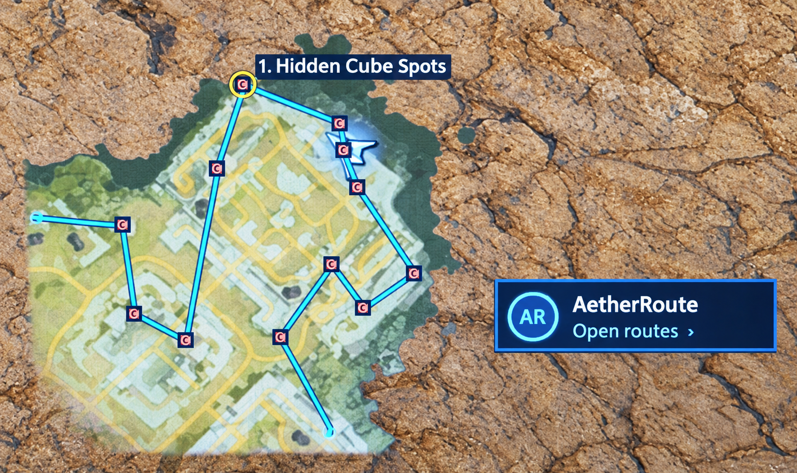
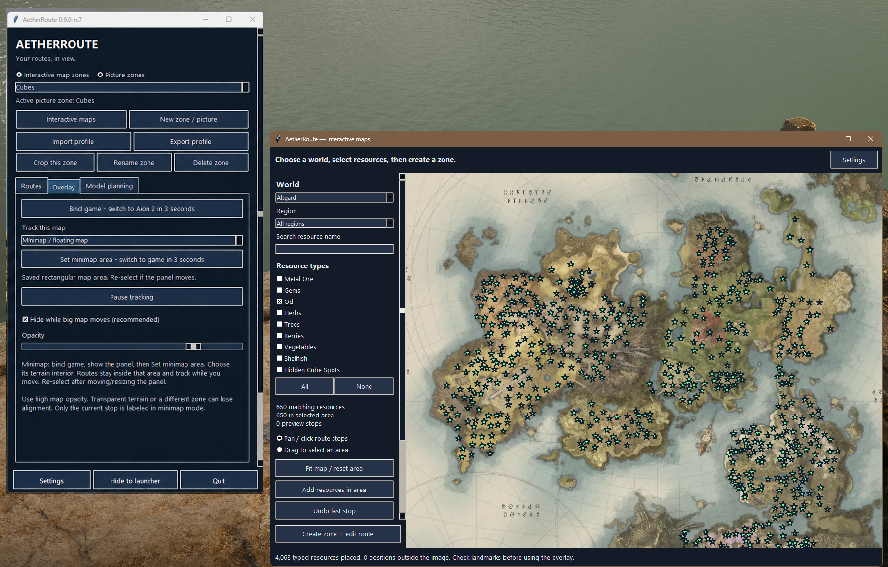
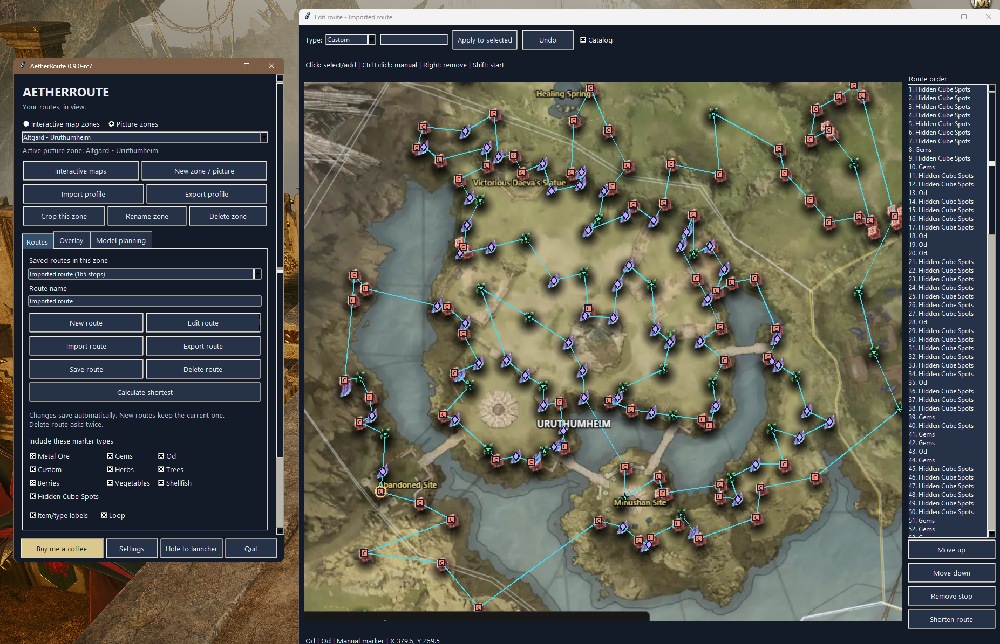
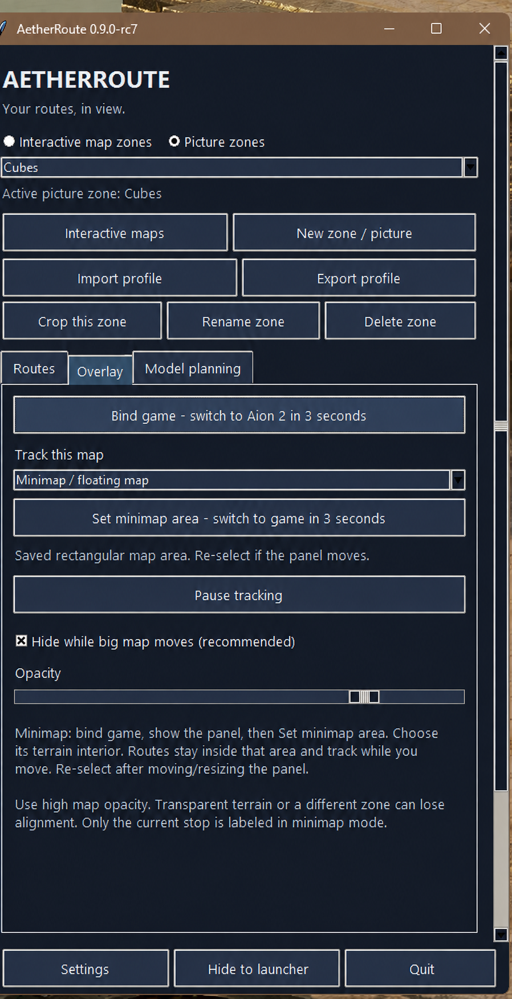
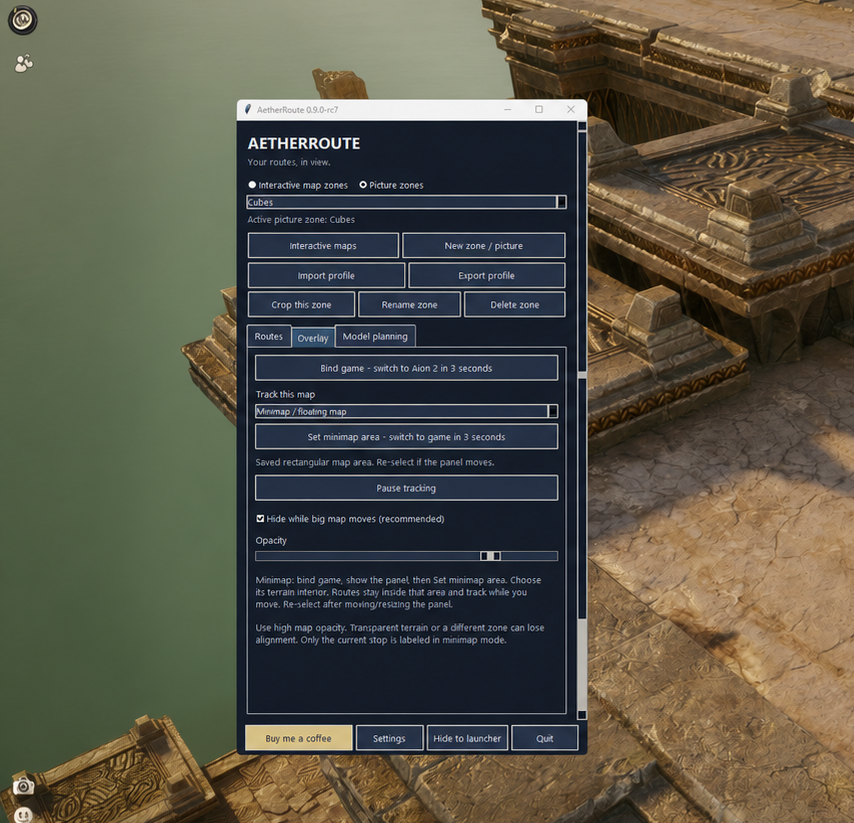
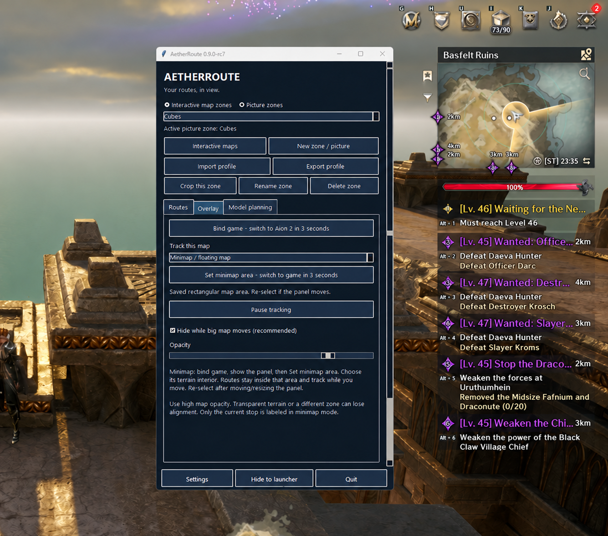

<div align="center">

# AetherRoute

**Your routes, in view.**

A free, open-source Windows tool for planning gathering routes and displaying them over Aion 2's map.

[Download for Windows](https://github.com/jsoverload/AetherRoute/releases) · [Quick start](#quick-start) · [Report a problem](https://github.com/jsoverload/AetherRoute/issues) · [Buy me a coffee](https://ko-fi.com/juiceoverload)

</div>



*The floating map overlay and launcher. Phone photo cleaned for readability.*

## What you can do

- **Plan on included maps.** Altgard and Verteron include resource locations and regions, ready to use.
- **Choose what to gather.** Filter by resource type or name, then work with a whole region or a smaller area.
- **Follow routes in game.** Display your stops over the big map, minimap or floating map.
- **Keep and share your work.** Save multiple zones and routes, import other players' profiles, or export your own.
- **Use your own map picture.** Create a separate picture zone and place stops manually.

## Install

Open [Releases](https://github.com/jsoverload/AetherRoute/releases) and choose a Windows download:

| Download | What to do |
| --- | --- |
| `AetherRoute-Setup-<version>.exe` | Run the installer, then open **AetherRoute** from the Start menu. |
| `AetherRoute-Windows-<version>-unsigned.zip` | Extract the **entire ZIP**, then run **AetherRoute.exe** inside it. |

Python is included in both Windows downloads. Use **Windowed** or **Borderless** mode in Aion 2.

A small AetherRoute launcher appears at the bottom-right. Click it to open the tool. **Hide to launcher**, or the window's **X**, hides the main window. **Quit** closes the application.

## Quick start

### 1. Choose a map and resources

Click **Interactive maps**, then choose **Altgard** or **Verteron** under **World**. Select the resource types you want. Use **Search resource name** to find a specific item.



The included maps already have their images, resource locations and bounds. No database download or website setup is needed.

### 2. Select an area and make a zone

1. Choose a named **Region**, or select **Drag to select an area** and drag a box on the map.
2. Switch to **Pan / click route stops**. Click resource symbols in the order you want to visit them.
3. Alternatively, click **Add resources in area** to include all matching resources in your selection.
4. Click **Create zone + edit route**, then give the zone a name.

Scroll to zoom; drag to move the map in **Pan / click route stops** mode. **Fit map / reset area** returns to the full map.

You can also create an empty zone and add its route in the editor afterward. New zones keep your existing zones.

### 3. Adjust your route

The editor shows your route and a list of stops. Clicking a resource from an included map automatically uses its resource type and name.



| Action | Control |
| --- | --- |
| Add a resource or select an existing stop | Click its symbol |
| Place a manual stop | Choose **Type**, then **Ctrl + click** |
| Remove a stop | Right-click it |
| Start the route from another stop | **Shift + click** that stop |
| Change the visit order | **Move up / Move down** |
| Reverse an edit | **Undo** |

Name the route in the main window. Changes save automatically. **New route** keeps the current one. Enable **Loop** to connect the last stop back to the first.

**Calculate shortest** reorders stops to reduce map distance. Review the result for cliffs, rivers and other travel barriers.

### 4. Show the route on the game map

1. Select the saved zone and route you want to use.
2. Open **Overlay** and set **Track this map** to **Big map**.
3. Click **Bind game**, then switch to Aion 2 within **three seconds**.
4. Press **M**, view the matching area, and wait for the route to align.

<p align="center">
  
</p>

*The screenshot shows minimap mode. Choose **Big map** for the full game map.*

Keep **Hide while big map moves** enabled if dragging causes tracking gaps. The route hides during movement and returns once the map settles.

Click the launcher to reopen the tool. You can drag it to another position; right-click it to reset its position or open its menu.

### 5. Use the minimap or floating map

1. Bind the game and show the map panel you want to track.
2. Click **Set minimap area**, then switch to the game within **three seconds**.
3. In the captured image, drag a box around **only the map terrain**. Leave its buttons and surrounding game UI outside the box.
4. Choose **Rectangle** or **Round**, then click **Use this map area**.



The tool switches to **Minimap / floating map**. Use high in-game map opacity, and select the area again if you move or resize the panel. Only the current stop is labeled in this mode.

## Useful shortcuts

These shortcuts work while the bound game is focused:

| Shortcut | Action |
| --- | --- |
| **Ctrl + Alt + N** | Next stop |
| **Ctrl + Alt + P** | Previous stop |
| **Ctrl + Alt + Space** | Pause or resume tracking |

## Save and share routes

- **Export profile** shares the zone image and its saved routes together. Use **Import profile** to open someone else's zone.
- **Export route / Import route** shares a single route. Both users need the same reference picture.
- **Delete route** and **Delete zone** each ask for confirmation twice.

For a backup you can move to another computer, export the profile before making major changes.

## Use your own map picture

Prefer a custom image? Click **New zone / picture**, choose your picture, name the zone, then use the whole image or select a crop.

To take a picture from the [Questlog Aion 2 interactive map](https://questlog.gg/aion-2/en/map):

1. Choose the world and show the resources you want.
2. Zoom until the terrain and resource symbols are clear. Keep useful landmarks visible.
3. Move the pointer away so no tooltip covers the map.
4. Press **Windows + Shift + S**, capture only the map, and save it as a **PNG**.
5. Import the PNG with **New zone / picture**. In the editor, choose **Type** and use **Ctrl + click** to place manual stops.

Picture zones and interactive map zones have separate saved-zone lists. An imported picture alone does not include a resource database.

## Optional: plan with your own model

Open **Model planning**, choose **Draw path from image**, and click **Export model pack (image + JSON)**. Extract the pack and give `map.png`, `legend.png`, `task.json` and the instructions in `PROMPT.txt` to your own image-capable model.

The image includes selected catalog resources even if they are not yet part of a route. Import the model's response JSON to create a new editable route, then review its path. AetherRoute does not connect to a model automatically or require an API key.


<details>
<summary>View the tool beside the game</summary>



</details>

## Troubleshooting

| Problem | Try this |
| --- | --- |
| No route appears | Check the saved zone and route, bind the correct game window, open the matching map area, and wait for alignment. |
| Route disappears while dragging | Let the map settle. **Hide while big map moves** is designed to hide the route during movement. |
| Minimap stops lining up | Re-select its terrain area after moving or resizing the panel. Increase the in-game map opacity. |
| Map opens off-center | Click **Fit map / reset area**. |
| Cannot see another saved zone | Select the correct group: **Interactive map zones** or **Picture zones**. |
| Need custom databases or icons | Enable **Settings → Developer mode**. See [MAP-PACKS.txt](MAP-PACKS.txt). |

See [README.txt](README.txt) for the full control reference. When reporting a problem, include the app version and what you were doing. Check screenshots for personal information before sharing them.

## Privacy and support

Tracking runs locally using visible map terrain. The tool does not read game memory, inject into the game or automate gathering. There are no ads, telemetry or automatic model connections.

Saved profiles stay in `%LOCALAPPDATA%\Aion2RouteSync`. Profile exports include their visible images, names and routes; model packs include the prompt you chose to export. See [SECURITY.txt](SECURITY.txt) for details.

AetherRoute is free and open source. If it helps you, you can support development on [Ko-fi](https://ko-fi.com/juiceoverload).

<details>
<summary>Run from source or build a Windows release</summary>

Install 64-bit Python 3.11–3.14 with tkinter, download the source, and double-click **START.cmd** on Windows. First setup installs pinned dependencies.

Run checks with:

```sh
python -m unittest discover -s tests -v
python app.py --self-test
```

To build locally, install Inno Setup 6 and run **BUILD.cmd**. The [Windows workflow](.github/workflows/windows.yml) also builds and tests the installer and portable ZIP. A tag matching `product.VERSION` creates a draft release with both downloads, a source ZIP and checksums. Publish that draft from GitHub **Releases** when ready.

Windows builds are currently unsigned. See [RELEASE.txt](RELEASE.txt) and [VALIDATION.txt](VALIDATION.txt) for build instructions and validation limits.

</details>

## License

Application code is [MIT licensed](LICENSE.txt). AetherRoute is an independent community project. Aion 2 map artwork and resource data retain their original rights; see [NOTICE.txt](NOTICE.txt) and [maps/NOTICE.txt](maps/NOTICE.txt).
