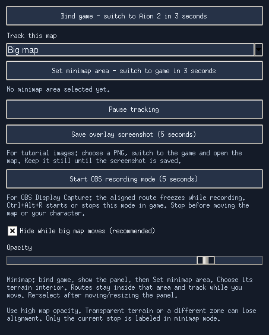

# AetherRoute: quick tutorial

For the map, route editor and minimap walkthrough with screenshots, see
[the main illustrated guide](README.md#quick-start).

The screenshot and OBS buttons below require **v0.9.0-rc8 or later**.

1. **Install.** Download the Setup EXE from [Releases](https://github.com/jsoverload/AetherRoute/releases).
   Open AetherRoute and click its small launcher at the bottom-right.
2. **Choose your map.** Click **Interactive maps**, select Altgard or Verteron,
   and choose the resources you want to gather. Select a region or drag an area.
3. **Make your route.** Click resources in visit order, then **Create zone + edit route**.
   Name your zone and adjust its stops in the editor. Changes save automatically.
4. **Show it in game.** Open **Overlay → Bind game**, switch to Aion 2 within
   three seconds, then press **M**. Wait for the route to align. Use Windowed
   or Borderless mode.
5. **Capture your tutorial.** Use either option below.

**For a PNG:** click **Save overlay screenshot (5 seconds)**, choose a filename,
switch back to the game and keep the map still. The saved image includes the
visible route. Reopen the app to see whether capture succeeded.

**For OBS:** add **Display Capture** for your monitor. Click **Start OBS recording
mode (5 seconds)**, then switch back to the game and keep the map still. The
aligned route freezes and becomes capturable. Press **Ctrl+Alt+R** or reopen
AetherRoute to finish. Stop this mode before moving the map or character.
Ctrl+Alt+R can also start it immediately while the route is aligned in game.

For a short video, show: choosing a map, selecting resources, adding stops,
then the aligned in-game route. The main window and editor record normally;
recording mode is for the floating route and launcher.

For the minimap, use **Set minimap area**, select its terrain interior and
choose **Minimap / floating map**. Captures work after its route is aligned.
